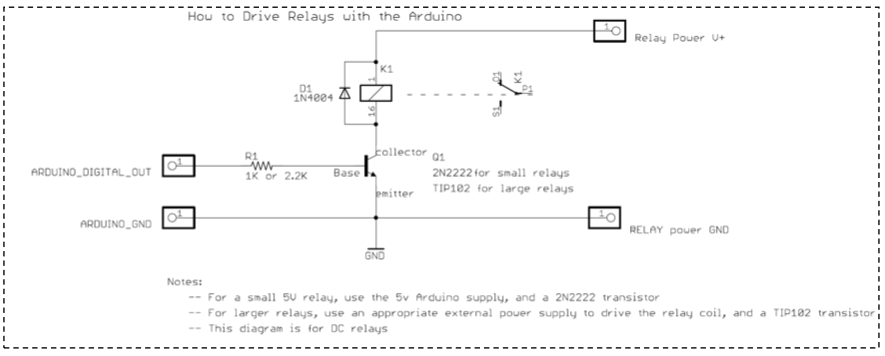
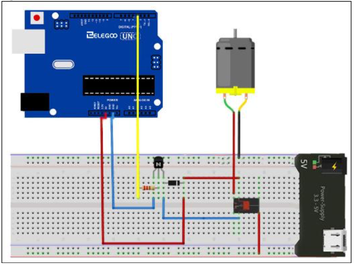
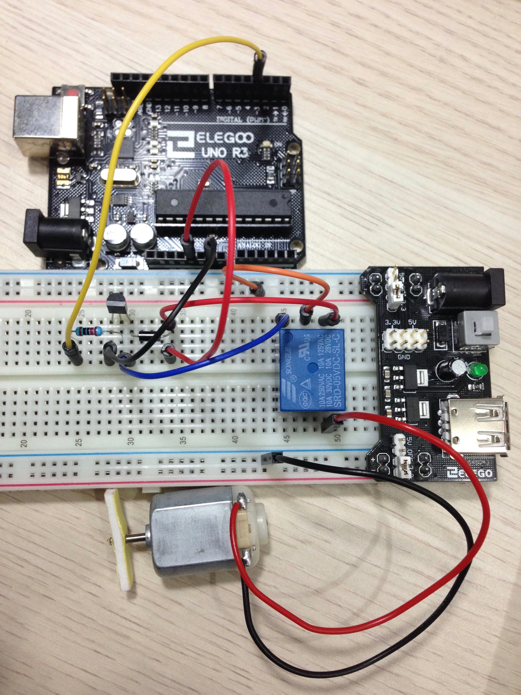
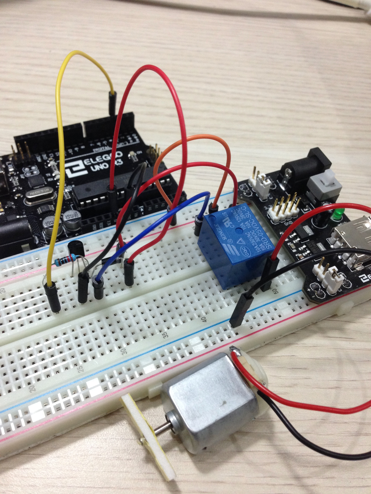
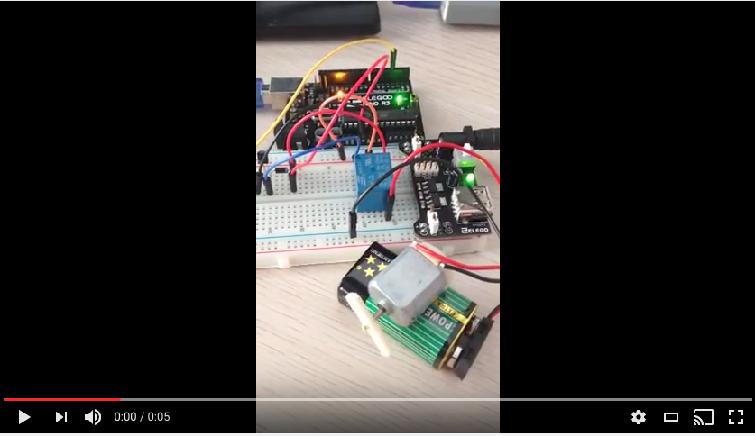

# Relay

**Relay** project shows... how to use a relay ^^

Author: **Huy Dang**

### Component Required

- (1) x Elegoo Uno R3 
- (1) x Breadboard 
- (1) x PN2222
- (1) x 1N4007
- (1) x 220 ohm resistor
- (1) x 6v dc motor
- (1) x Relay
- (1) x Breadboard power supply module 
- (1) x 9v power supply adapter
- (8) x M-M wires

### Schematic

### Wiring Diagram

### Wiring

## Video Walkthrough

GIF created with [LiceCap](http://www.cockos.com/licecap/).

## Notes

Describe any challenges encountered while working on project.

## License

    Copyright [2017] [Huy Dang]

    Licensed under the Apache License, Version 2.0 (the "License");
    you may not use this file except in compliance with the License.
    You may obtain a copy of the License at

        http://www.apache.org/licenses/LICENSE-2.0

    Unless required by applicable law or agreed to in writing, software
    distributed under the License is distributed on an "AS IS" BASIS,
    WITHOUT WARRANTIES OR CONDITIONS OF ANY KIND, either express or implied.
    See the License for the specific language governing permissions and
    limitations under the License.